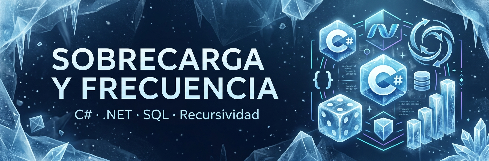
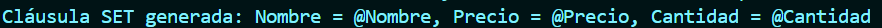
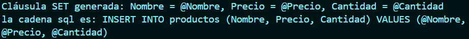
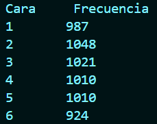
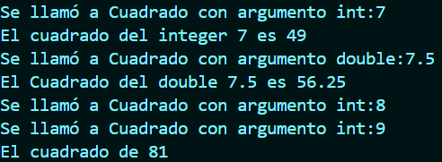
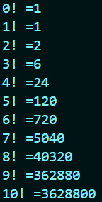

<div align="center">

# Sobrecarga y Frecuencia

### Ejercicios de programación en C# y .NET



<br>

[](https://dotnet.microsoft.com/)
[](https://dotnet.microsoft.com/)
[](https://www.mysql.com/)
[](https://git-scm.com/)
[](https://github.com/)

</div>

---

## Descripción

Este repositorio contiene una colección de ejercicios desarrollados en **C# utilizando .NET 10**, orientados al estudio y aplicación de diferentes conceptos de programación.

Los ejercicios abarcan temas como:

* Uso de estructuras `Dictionary`.
* Generación dinámica de consultas SQL.
* Simulación de frecuencias mediante lanzamientos de dados.
* Sobrecarga de métodos.
* Recursividad.
* Cálculo de factoriales.
* Consultas y ejemplos relacionados con SQL.
* Conceptos básicos relacionados con seguridad en consultas SQL.

El proyecto está organizado en diferentes carpetas, donde cada problema corresponde a un ejercicio independiente.

---

## Información académica

| Información          | Detalle                                          |
| -------------------- | ------------------------------------------------ |
| **Autor**            | Victor Montes                                    |
| **Materia**          | Herramientas De programacion Aplcada III |
| **Lenguaje**         | C#                                               |
| **Framework**        | .NET 10                                          |
| **Fecha de entrega** | 6 de octubre de 2026                             |
| **Repositorio**      | GitHub                                           |

---

# Contenido del proyecto

## Problema 1 — Diccionario y generación de SQL

### Imagen del ejercicio

> **Colocar aquí la imagen del Problema 1**

```text
assets/problema-1.png
```



### Descripción

Este ejercicio utiliza un `Dictionary<string, object>` para almacenar información de un producto:

* Nombre
* Precio
* Cantidad

Posteriormente, se recorren las claves del diccionario para construir dinámicamente una cláusula `SET` que puede utilizarse como parte de una sentencia SQL.

El programa muestra por consola la cláusula generada.

### Conceptos utilizados

* `Dictionary<TKey,TValue>`
* Tipos `object`
* Recorridos con `foreach`
* Interpolación de cadenas
* Construcción dinámica de consultas SQL
* Parámetros SQL mediante placeholders

---

## Problema 2 — Dictionary e INSERT SQL

### Imagen del ejercicio

> **Colocar aquí la imagen del Problema 2**

```text
assets/problema-2.png
```



### Descripción

En este ejercicio se utiliza nuevamente un diccionario para almacenar los datos de un producto.

A partir de sus claves y valores se genera dinámicamente una sentencia `INSERT`, construyendo tanto las columnas como los placeholders correspondientes.

El resultado de la consulta se muestra por consola.

### Conceptos utilizados

* `Dictionary<string, object>`
* `foreach`
* Colecciones
* Generación dinámica de SQL
* Placeholders
* Interpolación de strings

---

## Problema 3 — Frecuencia de lanzamiento de un dado

### Imagen del ejercicio

> **Colocar aquí la imagen del Problema 3**

```text
assets/problema-3.png
```



### Descripción

Este programa simula **6000 lanzamientos de un dado** utilizando la clase `Random`.

Cada lanzamiento genera un valor entre 1 y 6. Posteriormente, el programa contabiliza cuántas veces apareció cada cara del dado.

Finalmente, se muestra una tabla con la frecuencia obtenida para cada resultado.

### Conceptos utilizados

* Clase `Random`
* Generación de números aleatorios
* Variables acumuladoras
* Estructuras `switch`
* Ciclos `for`
* Conteo de frecuencias
* Simulación computacional

### Resultado esperado

El programa muestra una tabla similar a:

```text
Cara    Frecuencia
1       ...
2       ...
3       ...
4       ...
5       ...
6       ...
```

Debido a que los lanzamientos son aleatorios, los valores obtenidos pueden variar en cada ejecución.

---

## Problema 4 — Sobrecarga de métodos

### Imagen del ejercicio

> **Colocar aquí la imagen del Problema 4**

```text
assets/problema-4.png
```



### Descripción

Este ejercicio demuestra el concepto de **sobrecarga de métodos (Method Overloading)** en C#.

La clase `SobreCarga` contiene dos versiones del método `Cuadrado()`:

```csharp
public int Cuadrado(int valorInt)
```

y

```csharp
public double Cuadrado(double valorDouble)
```

Ambos métodos tienen el mismo nombre, pero reciben diferentes tipos de datos.

Esto permite que C# determine qué implementación utilizar dependiendo del argumento proporcionado.

### Conceptos utilizados

* Programación orientada a objetos
* Métodos
* Sobrecarga de métodos
* Tipos `int`
* Tipos `double`
* Clases y objetos
* Namespaces

---

## Problema 5 — Factorial mediante recursividad

### Imagen del ejercicio

> **Colocar aquí la imagen del Problema 5**

```text
assets/problema-5.png
```



### Descripción

Este ejercicio implementa el cálculo del factorial utilizando una función recursiva.

El programa calcula los factoriales desde `0` hasta `10`.

La función utilizada es:

```csharp
Factorial(numero)
```

La implementación utiliza un caso base y una llamada recursiva:

```text
Factorial(n) = n × Factorial(n - 1)
```

El caso base corresponde a los valores menores o iguales a `1`.

### Conceptos utilizados

* Recursividad
* Métodos
* Caso base
* Llamadas recursivas
* Tipo `long`
* Ciclo `for`

---

# Consultas SQL

El repositorio también contiene el archivo:

```text
CONSULTAS y DICCCIONARIOS.sql
```

Este archivo contiene diferentes ejemplos de consultas SQL utilizados como parte de las actividades, incluyendo consultas `SELECT`, `SHOW TABLES` y ejemplos relacionados con validaciones y seguridad de consultas.

> **Nota:** Algunos ejemplos del archivo están relacionados con SQL Injection y funciones de espera de bases de datos. Su finalidad dentro del proyecto es académica y experimental. No deben utilizarse contra sistemas, bases de datos o aplicaciones sin autorización.

---

# Tecnologías utilizadas

<div align="center">


</div>

---

# Estructura del proyecto

```text
Sobrecarga-y-Frecuencia/
│
├── .gitattributes
├── .gitignore
│
├── CONSULTAS y DICCCIONARIOS.sql
│
├── problema 1/
│   ├── Program.cs
│   └── Participacion #2.csproj
│
├── problema 2/
│   ├── Program.cs
│   └── problema 2.csproj
│
├── problema 3/
│   ├── Program.cs
│   └── probelma 3.csproj
│
├── problema 4/
│   ├── Program.cs
│   ├── SobreCarga.cs
│   └── problema 4.csproj
│
└── problema 5/
    ├── Program.cs
    └── problema 5.csproj
```

---

# Requisitos

Para ejecutar los proyectos se necesita:

* .NET 10 SDK
* Visual Studio, Visual Studio Code o cualquier IDE compatible con .NET
* Git, opcionalmente, para clonar el repositorio

---

# Ejecución

Cada problema es un proyecto independiente de consola.

Por ejemplo:

```bash
cd "problema 1"
dotnet run
```

Para ejecutar otro problema:

```bash
cd "problema 2"
dotnet run
```

También puede abrirse cada archivo `.csproj` directamente desde un IDE compatible con .NET.

---

# Conceptos aprendidos

A través de los diferentes ejercicios se trabajan varios conceptos fundamentales de programación:

| Concepto                         | Problema    |
| -------------------------------- | ----------- |
| `Dictionary`                     | 1 y 2       |
| Generación dinámica de SQL       | 1 y 2       |
| `Random`                         | 3           |
| Simulación                       | 3           |
| Frecuencia estadística           | 3           |
| `switch`                         | 3           |
| Sobrecarga de métodos            | 4           |
| Programación orientada a objetos | 4           |
| Recursividad                     | 5           |
| Caso base                        | 5           |
| Factorial                        | 5           |
| SQL                              | Archivo SQL |

---

# Referencias

* **Microsoft Learn — C#**

  https://learn.microsoft.com/dotnet/csharp/

* **Microsoft Learn — .NET**

  https://learn.microsoft.com/dotnet/

* **Microsoft Learn — C# Collections**

  https://learn.microsoft.com/dotnet/csharp/language-reference/builtin-types/collections

* **Microsoft Learn — Methods**

  https://learn.microsoft.com/dotnet/csharp/programming-guide/classes-and-structs/methods

* **Microsoft Learn — Method Overloading**

  https://learn.microsoft.com/dotnet/csharp/programming-guide/classes-and-structs/methods#method-overloading

* **Microsoft Learn — Recursion**

  https://learn.microsoft.com/dotnet/csharp/programming-guide/classes-and-structs/recursion

* **MySQL Documentation**

  https://dev.mysql.com/doc/

---

# Autor

<div align="center">

### Victor Montes

Estudiante de Ingeniería en Sistemas y Computación

Desarrollo de software · C# · .NET · SQL · Programación

</div>

---

<div align="center">

**Sobrecarga y Frecuencia**

Desarrollado con C# y .NET

</div>
